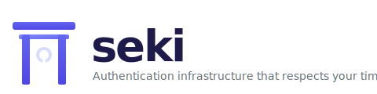
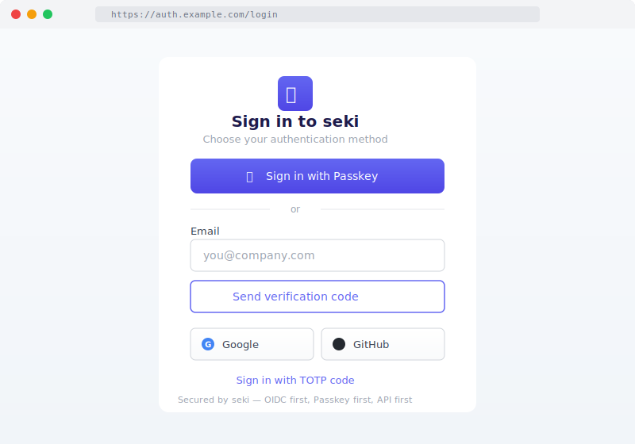
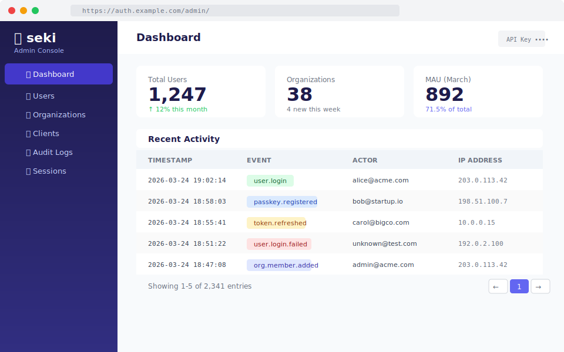

<p align="center">
  
</p>

<p align="center">
  <a href="https://github.com/entoten/seki/actions/workflows/ci.yml"></a>
  <a href="https://goreportcard.com/report/github.com/entoten/seki"></a>
  <a href="LICENSE"></a>
</p>

<p align="center"><strong>"5分で立ち上がって、ちゃんと安全で、APIが気持ちいい"</strong><br>現代的B2B SaaS向け認証コア</p>

---

seki（関所）は、自社SaaSを持つ開発チームのためのセルフホスト認証サーバーです。
OIDC Provider として正しく振る舞い、Passkey をデフォルトの認証手段とし、すべての操作を API で完結させます。

## Why seki?

- **Auth0/Clerk の依存リスクなし** -- 料金の不透明さ、データ所在の不安、outage 時の無力感から解放される。データは自分のインフラに置く。
- **Keycloak の重さなし** -- Go シングルバイナリ、100 MB 以下のメモリで起動。YAML 1つで設定完了。
- **パスキーが第一級** -- Passkey (WebAuthn) を主役とした認証フローを最初から設計。credential lifecycle management、fallback 戦略を組み込み済み。

## Features

| Category | Feature |
|----------|---------|
| OIDC | Authorization Code + PKCE, Client Credentials, Refresh Token, Discovery, JWKS |
| Auth | Passkey (WebAuthn) -- registration, login, discoverable credentials |
| Auth | TOTP with recovery codes |
| Auth | Password (opt-in, not default) |
| Auth | Social Login (Google, GitHub) |
| Identity | User CRUD + search |
| Identity | Organization / Tenant management |
| Identity | Role-based access control (RBAC) |
| Admin | REST API with API Key authentication |
| Ops | Audit Log (DB + stdout JSON) |
| Ops | Webhook emitter with HMAC-SHA256 signatures |
| Ops | Session management (DB-persistent, dual timeout) |
| Deploy | Docker / docker compose -- 1 command startup |
| Deploy | PostgreSQL (production) and SQLite (development) backends |

## Screenshots

**Login Page** — Passkey-first, with Magic Link, Social Login, TOTP fallbacks

<p align="center">
  
</p>

**Admin Console** — Dashboard with users, organizations, audit logs, MAU metrics

<p align="center">
  
</p>

## Quick Start (5 minutes)

### 1. Start seki

```bash
git clone https://github.com/entoten/seki.git
cd seki/docker
docker compose up -d
```

seki is now running at `http://localhost:8080`.

Verify:

```bash
curl http://localhost:8080/healthz
# {"status":"ok"}
```

### 2. Register your first OIDC client

The default `docker/seki.yaml` pre-configures a client `my-saas-app` with `http://localhost:3000/callback` as the redirect URI. To add your own, edit `docker/seki.yaml`:

```yaml
clients:
  - id: my-app
    name: "My Application"
    redirect_uris:
      - "http://localhost:3000/callback"
    grant_types:
      - authorization_code
    scopes:
      - openid
      - profile
      - email
    pkce_required: true
```

Restart seki to pick up the change:

```bash
docker compose restart seki
```

### 3. Try the login flow

Open the authorization endpoint in your browser:

```
http://localhost:8080/authorize?response_type=code&client_id=my-saas-app&redirect_uri=http://localhost:3000/callback&scope=openid+profile+email&state=test123&code_challenge=E9Melhoa2OwvFrEMTJguCHaoeK1t8URWbuGJSstw-cM&code_challenge_method=S256
```

You will see the login page. Register a passkey or set up TOTP to authenticate.

### 4. Exchange the code for tokens

```bash
curl -X POST http://localhost:8080/token \
  -d "grant_type=authorization_code" \
  -d "code=<CODE_FROM_REDIRECT>" \
  -d "redirect_uri=http://localhost:3000/callback" \
  -d "client_id=my-saas-app" \
  -d "code_verifier=dBjftJeZ4CVP-mB92K27uhbUJU1p1r_wW1gFWFOEjXk"
```

### 5. Fetch user info

```bash
curl -H "Authorization: Bearer <ACCESS_TOKEN>" http://localhost:8080/userinfo
```

## Configuration

seki is configured via a single YAML file. See [`seki.yaml.example`](seki.yaml.example) for the full reference with comments.

### Key sections

| Section | Purpose |
|---------|---------|
| `server` | Listen address, issuer URL |
| `database` | Driver (`postgres` or `sqlite`) and DSN |
| `signing` | Key algorithm (EdDSA default) and key file path |
| `clients` | OIDC client definitions (id, redirect URIs, grant types, scopes) |
| `organizations` | Tenant definitions with roles and permissions |
| `authentication` | Enable/disable passkey, TOTP, password, social login |
| `audit` | Output target (`stdout`, `webhook`, or `both`), retention |
| `webhooks` | Event subscriptions and endpoint configuration |
| `admin` | API key list for admin API authentication |

### Environment variable expansion

YAML values support `${ENV_VAR}` syntax for secrets:

```yaml
social:
  google:
    client_id: "${GOOGLE_CLIENT_ID}"
    client_secret: "${GOOGLE_CLIENT_SECRET}"
```

## API Reference

### OIDC Endpoints

| Method | Path | Description |
|--------|------|-------------|
| GET | `/.well-known/openid-configuration` | OIDC Discovery document |
| GET | `/.well-known/jwks.json` | JSON Web Key Set |
| GET | `/authorize` | Authorization endpoint (start OIDC flow) |
| POST | `/token` | Token endpoint (exchange code, refresh, client credentials) |
| GET | `/userinfo` | UserInfo endpoint (get authenticated user claims) |
| GET | `/login` | Login page |
| POST | `/login` | Login form submission |
| POST | `/logout` | End session |

### Authentication Endpoints

| Method | Path | Description |
|--------|------|-------------|
| POST | `/authn/passkey/register/begin` | Start passkey registration |
| POST | `/authn/passkey/register/finish` | Complete passkey registration |
| POST | `/authn/passkey/login/begin` | Start passkey login |
| POST | `/authn/passkey/login/finish` | Complete passkey login |
| POST | `/authn/passkey/login/discoverable/begin` | Start discoverable credential login |
| POST | `/authn/passkey/login/discoverable/finish` | Complete discoverable credential login |
| GET | `/authn/passkey/credentials` | List user's passkey credentials |
| GET | `/authn/passkey/credentials/inactive` | List inactive credentials |
| PATCH | `/authn/passkey/credentials/{id}` | Rename a credential |
| DELETE | `/authn/passkey/credentials/{id}` | Delete a credential |
| POST | `/authn/totp/setup/begin` | Start TOTP setup (get QR code) |
| POST | `/authn/totp/setup/finish` | Verify TOTP setup |
| POST | `/authn/totp/verify` | Verify TOTP code |
| POST | `/authn/totp/recovery` | Use a recovery code |
| POST | `/authn/password/register` | Set password for user |
| POST | `/authn/password/verify` | Verify password |
| POST | `/authn/password/change` | Change password |
| GET | `/authn/social/{provider}/authorize` | Start social login (Google, GitHub) |
| GET | `/authn/social/{provider}/callback` | Social login callback |

### Admin API (requires API Key)

All admin endpoints are under `/api/v1/` and require an `Authorization: Bearer <API_KEY>` header.

| Method | Path | Description |
|--------|------|-------------|
| POST | `/api/v1/users` | Create a user |
| GET | `/api/v1/users` | List users (cursor-based pagination) |
| GET | `/api/v1/users/{id}` | Get a user by ID |
| PATCH | `/api/v1/users/{id}` | Update a user |
| DELETE | `/api/v1/users/{id}` | Delete a user |
| POST | `/api/v1/orgs` | Create an organization |
| GET | `/api/v1/orgs` | List organizations |
| GET | `/api/v1/orgs/{slug}` | Get an organization by slug |
| PATCH | `/api/v1/orgs/{slug}` | Update an organization |
| DELETE | `/api/v1/orgs/{slug}` | Delete an organization |
| POST | `/api/v1/orgs/{slug}/members` | Add a member to an organization |
| GET | `/api/v1/orgs/{slug}/members` | List organization members |
| DELETE | `/api/v1/orgs/{slug}/members/{user_id}` | Remove a member |
| PATCH | `/api/v1/orgs/{slug}/members/{user_id}` | Update a member's role |
| POST | `/api/v1/orgs/{slug}/roles` | Create a role |
| GET | `/api/v1/orgs/{slug}/roles` | List roles |
| PATCH | `/api/v1/orgs/{slug}/roles/{name}` | Update a role |
| DELETE | `/api/v1/orgs/{slug}/roles/{name}` | Delete a role |
| GET | `/api/v1/audit-logs` | List audit logs (cursor-based pagination) |

### Operations

| Method | Path | Description |
|--------|------|-------------|
| GET | `/healthz` | Health check |

Errors follow [RFC 7807 Problem Details](https://www.rfc-editor.org/rfc/rfc7807):

```json
{
  "type": "about:blank",
  "title": "Not Found",
  "status": 404,
  "detail": "user not found"
}
```

See the full OpenAPI spec at [`api/openapi.yaml`](api/openapi.yaml). An interactive API explorer is available at `/api/docs` when seki is running.

See [Standards Compliance](docs/standards-compliance.md) for full RFC coverage.

## Architecture

Single Go binary. One database. One config file.

```
┌─────────────────────────────────────────────┐
│                   seki                       │
│                                              │
│  ┌─────────┐  ┌──────────┐  ┌────────────┐  │
│  │  OIDC   │  │  Admin   │  │  Webhook   │  │
│  │ Provider│  │   API    │  │  Emitter   │  │
│  └────┬────┘  └────┬─────┘  └─────┬──────┘  │
│       │            │              │          │
│  ┌────┴────────────┴──────────────┴───────┐  │
│  │            Core Engine                 │  │
│  │  ┌──────┐ ┌──────┐ ┌──────┐ ┌──────┐  │  │
│  │  │ User │ │ Org  │ │ Auth │ │Audit │  │  │
│  │  │ Mgmt │ │Tenant│ │ Flow │ │ Log  │  │  │
│  │  └──────┘ └──────┘ └──────┘ └──────┘  │  │
│  └───────────────────┬────────────────────┘  │
│                      │                       │
│  ┌───────────────────┴────────────────────┐  │
│  │           Storage Layer                │  │
│  │     PostgreSQL / SQLite (switchable)   │  │
│  └────────────────────────────────────────┘  │
└──────────────────────────────────────────────┘
        │              │              │
   ┌────┴────┐   ┌────┴────┐   ┌────┴────┐
   │ Your    │   │ Your    │   │External │
   │ Web App │   │ Mobile  │   │Services │
   │ (OIDC)  │   │  App    │   │  (M2M)  │
   └─────────┘   └─────────┘   └─────────┘
```

**Tech stack:**
- Language: Go (single binary, fast startup)
- Database: PostgreSQL (production) / SQLite (development)
- Config: YAML + environment variable expansion
- Signing: Ed25519 (default), RSA supported
- HTTP: Go standard library `net/http`

## What seki doesn't do

seki has an honest scope. These are explicitly out of scope:

| Feature | Reason |
|---------|--------|
| SAML IdP/SP | Enterprise federation is real, but not our initial focus. Use Keycloak or Zitadel. |
| SCIM provisioning | Same context as SAML. Planned for v1.0. |
| LDAP bridge | Legacy compatibility is Keycloak's job. |
| Fine-grained policy engine (ABAC/ReBAC) | RBAC covers most B2B cases. v0.2 will evaluate. |
| HA cluster / horizontal scaling | Single-node performance is the priority first. |
| Email/SMS delivery engine | Webhook to your existing email/SMS provider. No built-in SMTP. |
| Mobile SDK | Standard OIDC works with any mobile OAuth library. |
| Self-service user portal | Your application's responsibility, not the auth server's. |

## Competitive Comparison

|                 | Auth0 | Clerk | Keycloak | Zitadel | Authentik | **seki** |
|-----------------|-------|-------|----------|---------|-----------|----------|
| Deployment      | SaaS  | SaaS  | Self-host | Both   | Self-host | **Self-host** |
| Startup speed   | N/A   | N/A   | Slow     | Medium  | Medium    | **Fast** |
| Passkey         | Yes   | Yes   | Partial  | Yes     | Partial   | **First-class** |
| OIDC            | Yes   | Yes   | Yes      | Yes     | Yes       | **OIDC-only** |
| SAML            | Yes   | No    | Yes      | Yes     | Yes       | **No (by design)** |
| API first       | Yes   | Yes   | Partial  | Yes     | Partial   | **Yes** |
| Config as Code  | Partial | No | Partial  | Yes     | Partial   | **YAML native** |
| Audit log       | Yes   | Partial | Partial | Yes    | Yes       | **Day 1** |
| B2B tenants     | Yes   | Yes   | Partial  | Yes     | No        | **Yes** |
| Learning curve  | Low   | Low   | High     | Medium  | Medium    | **Low** |
| Data sovereignty| No    | No    | Yes      | Partial | Yes       | **Yes** |
| Pricing risk    | High  | High  | None     | Medium  | None      | **None** |

**Use seki if** you want to own your auth infrastructure without the weight of Keycloak and with first-class Passkey support.

**Don't use seki if** you need SAML federation (use Keycloak), want zero auth maintenance (use Auth0/Clerk), or need enterprise IAM (use Authentik/Keycloak).

## Contributing

Contributions are welcome. Please open an issue to discuss before submitting large changes.

```bash
# Build
make build

# Test
make test

# Run locally
make run
```

## License

[Apache License 2.0](LICENSE)
